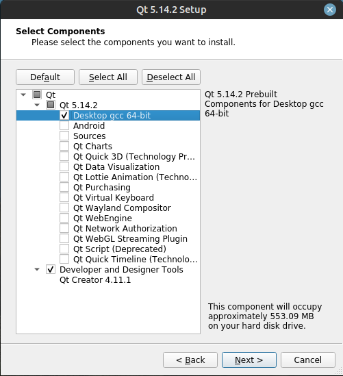

# qt-on-linux

## qt-sdk

*单独配置qt开发环境，再单独下载qt-creator，因为5.14.2可能在某些发行版上不可用*

### QT_gcc.7z

下载QT_gcc.7z一个即可

### 配置环境

解压后配置环境变量`sudo vim /etc/profile`,shift+g键移动到末尾，追加：

```bash
export QTDIR=QT_gcc目录
export PATH=$QTDIR/bin:$PATH
export MANPATH=$QTDIR/man:$MANPATH
export LD_LIBRARY_PATH=$QTDIR/lib:$LD_LIBRARY_PATH
```

enable qt environment：`source /etc/profile`

enablle when starting :`vim ~/.bashrc`,追加：

```bash
source /etc/profile
```

### apt下载qtcreator(更适配)

```bash
sudo apt install qtcreator -y
```

## qt-linux-x64-5.14.2

完整的qt安装包，也是最后的开源支持版本

下载qt-opensource-linux目录中的所有文件，解压001

md5:dce0588874fd369ce493ea5bc2a21d99

sha256:2f0a8e63f3deec5a670e9374e165bb40f5111f428909d2fa68532c2fab85e62d

### 赋权限

```bash
chmod +x qt-opensource-linux-x64-5.14.2.run
```

### 安装

```bash
./qt-opensource-linux-x64-5.14.2.run
```

### 选择qt的开发环境



Desktop gcc 64-bit是必须选的，虽然名字是gcc，但实际是qt专用的开发包（qmake等），其他按需求安装

### 卸载

进入qt安装目录

```bash
./MaintenanceTool
```
